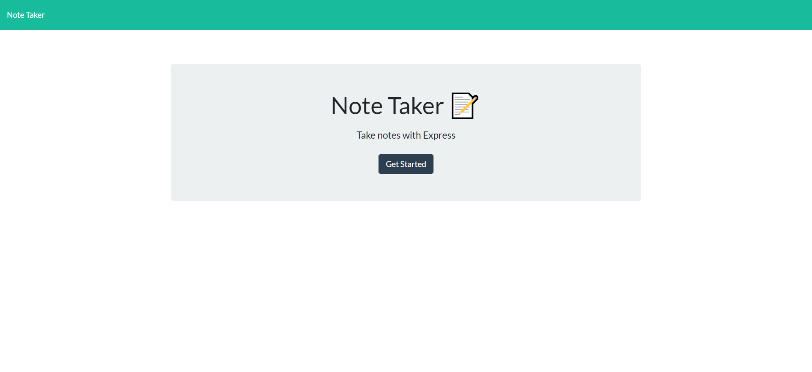
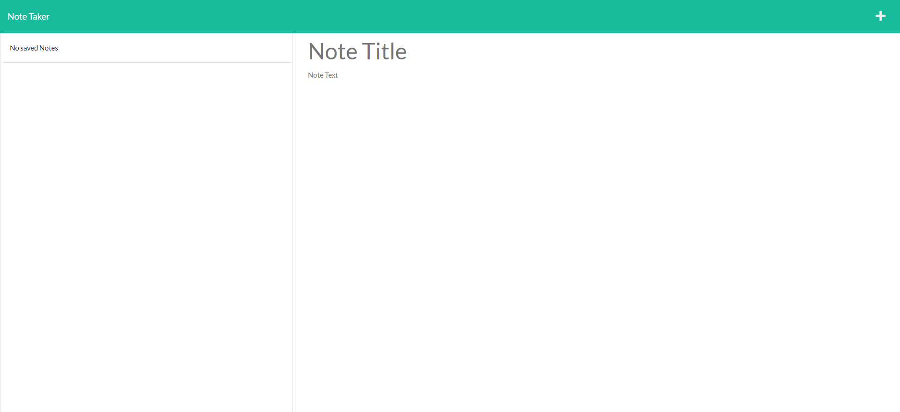
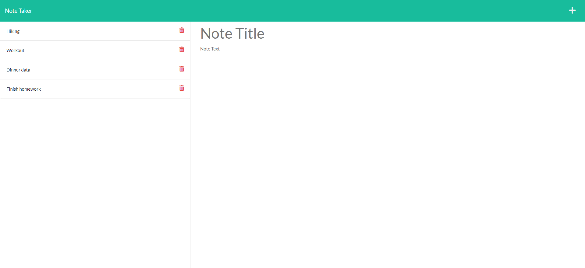

# Business Note Taker

## Table of contents

- [Business Note Taker](#business-note-taker)
  - [Table of contents](#table-of-contents)
  - [Description](#description)
  - [Live Application](#live-application)
  - [User story](#user-story)
  - [Technical steps](#technical-steps)
  - [Getting Started](#getting-started)
    - [Installation](#installation)
      - [Clone repository](#clone-repository)
      - [Install packages](#install-packages)
    - [Usage](#usage)
  - [Packages Used](#packages-used)
  - [Questions](#questions)
  - [Screenshots](#screenshots)
    - [Start page](#start-page)
    - [Notes Page](#notes-page)
      - [No added notes](#no-added-notes)
      - [Added notes](#added-notes)

## Description

This is a note taker application designed to be utilised as a tool in creating, viewing and deleting notes. It allows the user to access their saved notes, together with option to add a new note, edit or delete. The application is live deployed using Heroku.

## Live Application

Click [here](https://business-note-taker.herokuapp.com/) to view the live app deployed on Heroku.

## User story

```
GIVEN a note-taking application
WHEN I open the Note Taker
THEN I am presented with a landing page with a link to a notes page
WHEN I click on the link to the notes page
THEN I am presented with a page with existing notes listed in the left-hand column, plus empty fields to enter a new note title and the note’s text in the right-hand column
WHEN I enter a new note title and the note’s text
THEN a Save icon appears in the navigation at the top of the page
WHEN I click on the Save icon
THEN the new note I have entered is saved and appears in the left-hand column with the other existing notes
WHEN I click on an existing note in the list in the left-hand column
THEN that note appears in the right-hand column
WHEN I click on the Write icon in the navigation at the top of the page
THEN I am presented with empty fields to enter a new note title and the note’s text in the right-hand column
```

## Technical steps

- added server routes and controller functions
- connected the front-end to the server through `view` routes
- added `GET` methods to access the notes saved in the database file
- added `POST` method to add a new note
- added `DELETE` method to add an existing note

## Getting Started

### Installation

To run the application, you will need to have [node.js](https://nodejs.org/en/) installed.

#### Clone repository

`git clone git@github.com:lianavaleria15/business-note-taker.git`

#### Install packages

- use `npm init -y` to install package.json

### Usage

- run `npm run start` in the terminal to be prompted with the questions

## Packages Used

- Nodemon
- Express JS
- UUID

## Questions

If you have any questions related to the application or repository, would like to collaborate or open an issue, please use the contact details below:

- 👩 [Liana Laurentiu](https://github.com/lianavaleria15)
- 📧 [liana.valeria15@gmail.com](mailto:liana.valeria15@gmail.com)

## Screenshots

### Start page

)

### Notes Page

#### No added notes



#### Added notes


